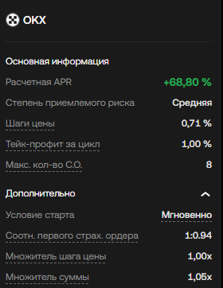
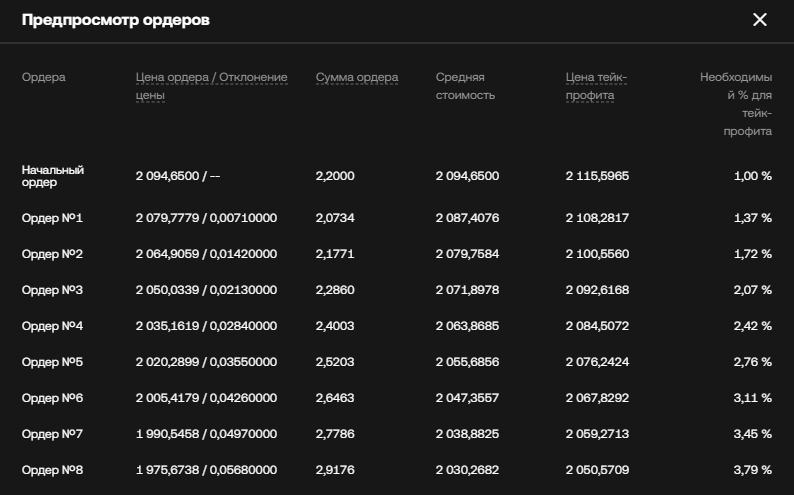

Задача сравнить нашего робота DCA с роботом с биржи OKX.

У робота с биржи вот такие настройки:

Вот такой план работы ордеров:

Можно ли настроит нашего робота с такими же параметрами, без изменения кода и логики работы?

Хочу посмотреть получится ли у нашего робота такой же расчетный APR как у робота с биржи.